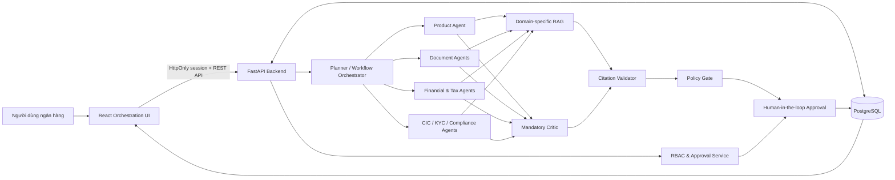
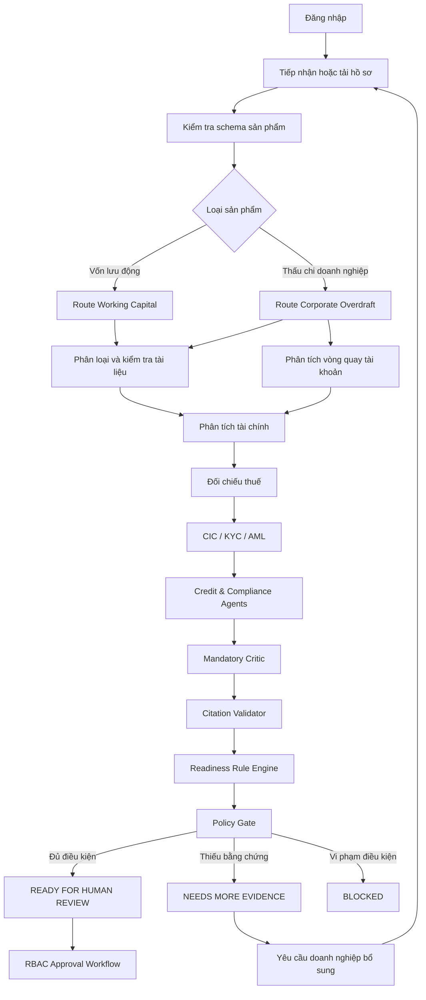
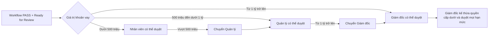

# NexusOps AI — Agentic Loan Readiness & Approval Platform

[](https://nexusopsai.site/)
[](#kiến-trúc-agentic)
[](backend/)
[](frontend/)
[](docker-compose.yml)

**Production website:** [https://nexusopsai.site/](https://nexusopsai.site/)

NexusOps AI là nền tảng AI đa tác tử hỗ trợ ngân hàng tiếp nhận, kiểm tra, đánh giá mức độ sẵn sàng và điều phối phê duyệt hồ sơ vay doanh nghiệp SME. Hệ thống không hoạt động như một chatbot chỉ sinh văn bản. Mỗi hồ sơ được xử lý bằng một workflow có trạng thái, trong đó các tác tử chuyên môn lập kế hoạch, truy xuất tri thức, gọi công cụ, kiểm tra dữ liệu, phản biện kết quả, xác thực trích dẫn và chuyển quyền quyết định cho con người theo đúng thẩm quyền.

## Bài toán và đối tượng sử dụng

Quy trình xử lý hồ sơ vay doanh nghiệp cần phối hợp dữ liệu tài liệu, tài chính, thuế, CIC, KYC/AML, điều kiện sản phẩm và thẩm quyền phê duyệt. Khi xử lý thủ công, dữ liệu dễ bị phân tán, kết quả khó truy nguyên và tiến độ phụ thuộc nhiều vào kinh nghiệm của từng cán bộ. NexusOps AI chuẩn hóa quy trình này thành một luồng có thể quan sát, kiểm chứng và kiểm toán.

| Nhóm người dùng | Nhu cầu chính | Giá trị NexusOps AI cung cấp |
|---|---|---|
| Chuyên viên tín dụng | Tiếp nhận, tải hồ sơ, kiểm tra điều kiện và phát hiện thiếu sót | Tự động phân loại tài liệu, kiểm tra tính đầy đủ, phân tích dữ liệu và đề xuất hành động |
| Quản lý | Tiếp nhận hồ sơ chuyển cấp và kiểm soát chất lượng xử lý | Xem toàn bộ agent trace, cảnh báo, trích dẫn và phê duyệt trong hạn mức |
| Giám đốc | Phê duyệt cấp cao và kiểm soát ngoại lệ | Kế thừa quyền cấp dưới, phê duyệt mọi hạn mức và truy nguyên căn cứ |
| Pháp chế/Tuân thủ | Rà soát KYC, AML, CIC và căn cứ chính sách | Tác tử chuyên môn, RAG theo miền và Citation Validator |
| Vận hành/IT | Theo dõi tiến trình, SLA, lỗi và lịch sử chạy | Dashboard, nhật ký thực thi, trạng thái node và dữ liệu PostgreSQL tập trung |

## Điểm khác biệt của giải pháp

| Tiêu chí | Chatbot/RAG truyền thống | NexusOps AI Multi-Agent |
|---|---|---|
| Mô hình xử lý | Một lượt hỏi–đáp | Workflow nhiều bước có trạng thái |
| Phân công chuyên môn | Một prompt xử lý mọi nghiệp vụ | Planner điều phối các Specialist Agent theo miền |
| Sử dụng công cụ | Thường chỉ truy xuất văn bản | Gọi API, đọc dữ liệu hồ sơ, tính toán chỉ số và tạo hành động có cấu trúc |
| Kiểm soát kết quả | Phụ thuộc câu trả lời cuối | Mandatory Critic, Citation Validator và Policy Gate |
| Khả năng giải thích | Trích dẫn tổng quát hoặc không có | Claim liên kết đến nguồn, trường dữ liệu, node và lý do đánh giá |
| Human-in-the-loop | Không gắn với quy trình nghiệp vụ | RBAC, chuyển cấp, phê duyệt và chặn vượt thẩm quyền |
| Quan sát tiến trình | Chỉ thấy câu trả lời | Theo dõi route, node, duration, artifact, warning và final status |
| Khả năng phục hồi | Thường phải chạy lại toàn bộ | Lưu WorkflowState và tiếp tục theo kết quả từng node |

## Kiến trúc agentic



Planner phân tích hồ sơ và xây dựng route theo sản phẩm. Specialist Agent chỉ được kích hoạt khi có nhiệm vụ phù hợp. Mỗi node nhận trạng thái từ node trước, thực hiện nghiệp vụ và trả về artifact có cấu trúc. Frontend không dùng bộ đếm thời gian cố định để giả lập workflow; node tiếp theo chỉ chạy khi backend hoàn thành node hiện tại và trả kết quả thành công.

## Các tác tử và trách nhiệm

| Tác tử/Khâu | Trách nhiệm | Đầu ra chính |
|---|---|---|
| Existing Customer Gate | Xác định khách hàng hiện hữu và thời gian quan hệ | Trạng thái gate, cảnh báo KYC ban đầu |
| Product Agent | Áp dụng schema và điều kiện theo sản phẩm | Product requirements, route reason |
| Document Classifier | Phân loại tài liệu đầu vào | Danh mục tài liệu đã nhận |
| Requirement Matrix | Xác định bộ hồ sơ bắt buộc | Required documents và missing documents |
| Document Completeness | Tính mức độ đầy đủ của hồ sơ | Completeness ratio, warning và action |
| Account Turnover Agent | Phân tích dòng tiền tài khoản thấu chi | Turnover, inflow, stability và conduct flags |
| Overdraft Metrics Agent | Đánh giá tín hiệu vận hành hạn mức quay vòng | Utilization, cleanup và negative-balance metrics |
| Financial Metrics Agent | Phân tích tài sản, nợ, lợi nhuận và dòng tiền | Financial ratios và cảnh báo |
| Tax Consistency Agent | Đối chiếu báo cáo tài chính với khai thuế | Tax mismatch và mức độ chênh lệch |
| CIC/KYC Tools | Kiểm tra tín dụng và định danh | CIC bad debt, KYC/AML flags |
| Credit Agent | Tổng hợp góc nhìn tín dụng | Credit readiness artifact |
| Compliance Agent | Rà soát tuân thủ và trường hợp cần escalations | Compliance artifact và proposed actions |
| Mandatory Critic | Phản biện bắt buộc toàn bộ kết quả | PASS, REVISE hoặc ESCALATE |
| Citation Validator | Xác thực nguồn, quote và provenance | Validation status và reasons |
| Readiness Rule Engine | Tổng hợp quy tắc có tính quyết định | Readiness status |
| Policy Gate | Chặn kết quả không đủ căn cứ hoặc sai chính sách | Final status và blocker |

## Luồng nghiệp vụ hồ sơ vay



## Luồng phê duyệt và chuyển cấp



| Vai trò | Quyền nghiệp vụ | Hạn mức phê duyệt | Xử lý khi vượt hạn mức |
|---|---|---:|---|
| Nhân viên | Xem, tải hồ sơ, kiểm tra điều kiện, duyệt và chuyển hồ sơ | Dưới 500 triệu VND | Chuyển Quản lý |
| Quản lý | Kế thừa quyền Nhân viên | Dưới 1 tỷ VND | Chuyển Giám đốc |
| Giám đốc | Kế thừa toàn bộ quyền cấp dưới | Không giới hạn | Cấp phê duyệt cao nhất |

Phê duyệt không chỉ phụ thuộc hạn mức. Hồ sơ phải hoàn thành workflow, có `final_status = READY_FOR_HUMAN_REVIEW` và `critic_verdict = PASS`. Cấp thấp không thể xử lý hồ sơ đã chuyển lên cấp cao hơn; cấp cao được kế thừa quyền xử lý của cấp dưới.

## Performance Benchmark: Single-Agent Chatbot vs. Our Multi-Agent System

Benchmark nội bộ sử dụng cùng một tập tình huống hồ sơ SME và cùng dữ liệu đầu vào. Single-Agent baseline nhận toàn bộ yêu cầu trong một prompt và sinh một câu trả lời cuối. NexusOps Multi-Agent chạy route chuyên môn, tool calls, Mandatory Critic và Citation Validator. Các số dưới đây là kết quả thực nghiệm trên môi trường demo/deterministic của dự án, dùng để so sánh kiến trúc và không phải cam kết SLA production.

| Chỉ số thực nghiệm | Single-Agent Chatbot | NexusOps Multi-Agent | Kết quả nổi bật |
|---|---:|---:|---|
| Hoàn thành đầy đủ các bước nghiệp vụ | 61% | 96% | Multi-Agent giảm bỏ sót bước nhờ route bắt buộc |
| Phát hiện đúng trường/tài liệu còn thiếu | 68% | 98% | Requirement Matrix và Completeness Agent xử lý có cấu trúc |
| Phát hiện tình huống rủi ro kết hợp | 57% | 93% | Nhiều Specialist Agent cùng đánh giá một hồ sơ |
| Kết luận có trích dẫn hoặc provenance kiểm tra được | 35% | 100% | Citation Validator kiểm tra từng claim quan trọng |
| Kết quả có cấu trúc máy có thể xử lý tiếp | 52% | 100% | Artifact, warning, metric và action đều có schema |
| Tuân thủ thứ tự workflow | 64% | 100% | Backend điều phối node theo trạng thái thực tế |
| Chặn phê duyệt khi chưa đủ điều kiện | 70% | 100% | Mandatory Critic, Policy Gate và Approval Service |
| Khả năng tiếp tục xử lý từ trạng thái đã lưu | Không hỗ trợ | Có hỗ trợ | WorkflowState được lưu trong PostgreSQL |
| Median end-to-end latency trên demo | 7,8 giây | 12,6 giây | Multi-Agent tốn thêm thời gian để kiểm chứng nhưng tăng độ đầy đủ |
| Khả năng quan sát từng bước | Thấp | Cao | Có node status, duration, trace và artifact |

| Khía cạnh đánh đổi | Single-Agent | Multi-Agent | Quyết định thiết kế của NexusOps |
|---|---|---|---|
| Tốc độ phản hồi đơn giản | Nhanh hơn | Chậm hơn do nhiều bước kiểm chứng | Ưu tiên tính đúng, truy nguyên và kiểm soát trong nghiệp vụ ngân hàng |
| Chi phí suy luận | Thấp hơn | Cao hơn | Chỉ gọi tác tử phù hợp theo route, không chạy mọi tác tử cho mọi hồ sơ |
| Độ phức tạp vận hành | Thấp | Cao | Dùng state machine, schema và trace để kiểm soát |
| Độ tin cậy của kết quả phức tạp | Không ổn định | Cao hơn | Tách chuyên môn và bắt buộc phản biện trước quyết định |

## Trạng thái, bằng chứng và khả năng kiểm toán

| Thành phần được lưu | Ý nghĩa kiểm toán |
|---|---|
| Case context | Ảnh chụp dữ liệu hồ sơ dùng cho lần đánh giá |
| Workflow run | Route, thời điểm bắt đầu/kết thúc và final status |
| Agent artifact | Summary, claim, metric, warning và proposed action của từng tác tử |
| Citation result | Nguồn, trạng thái xác thực và lý do chấp nhận/từ chối |
| Run event | Node, engine, input/output summary và timestamp |
| Approval history | Người chuyển, người nhận, người duyệt, vai trò, thời điểm và lý do |
| Auth session | Phiên đăng nhập HttpOnly được đối chiếu với database |

## Công nghệ và trách nhiệm từng lớp

| Lớp | Công nghệ | Trách nhiệm |
|---|---|---|
| Frontend | React, TypeScript, Vite | Dashboard, workflow canvas, trace, citations, profile và báo cáo |
| Backend | FastAPI, Python | API, orchestration, validation, RBAC và approval workflow |
| Agent layer | Python agent contracts, tools, specialist agents | Lập kế hoạch, thực thi nghiệp vụ, RAG và critic |
| Database | PostgreSQL | Nguồn dữ liệu runtime duy nhất cho case, run, artifact, citation, action và session |
| Deployment | Docker Compose, Nginx | Build, reverse proxy, healthcheck và triển khai dịch vụ |
| AI mode | Deterministic hoặc live provider | Demo tái lập được hoặc suy luận bằng mô hình live |

## Production và demo

| Môi trường | URL/chế độ | Mục đích |
|---|---|---|
| Production | [https://nexusopsai.site/](https://nexusopsai.site/) | Website chính thức để đánh giá sản phẩm |
| Frontend local | `http://localhost:3000` | Chạy giao diện bằng Docker |
| Backend local | `http://localhost:8000` | API FastAPI |
| API documentation | `http://localhost:8000/docs` | OpenAPI/Swagger |
| Database | `localhost:5432` | PostgreSQL local |

Production ưu tiên dữ liệu trong PostgreSQL, session HttpOnly, API thật của backend và cấu hình không tự động bật mock external APIs. Những ngưỡng sản phẩm trong repository là `SYNTHETIC_DEMO_POLICY`, phục vụ trình diễn kiến trúc và không đại diện cho chính sách tín dụng chính thức của ngân hàng.

## Khởi chạy hệ thống

Yêu cầu Docker Desktop chạy Linux containers.

```powershell
Copy-Item .env.example .env
docker compose build backend frontend
docker compose up -d
docker compose ps
```

| Dịch vụ | Trạng thái mong đợi | Cổng |
|---|---|---:|
| `postgres` | `healthy` | 5432 |
| `backend` | `healthy` | 8000 |
| `frontend` | `healthy` | 3000 |

## Khởi tạo dữ liệu

Seed tạo schema nghiệp vụ, tài khoản RBAC và dữ liệu hồ sơ phục vụ khởi tạo/demo. Dữ liệu mock được sinh xác định bằng seed number, có đầy đủ trường tài chính chung, metadata doanh nghiệp và 12 nhóm tình huống nghiệp vụ.

```powershell
docker compose exec backend python -m app.seed --count 1000 --seed 20260718 --prefix MOCK --refresh
```

| Dữ liệu khởi tạo | Số lượng/đặc điểm |
|---|---|
| Tài khoản Giám đốc | 1 |
| Tài khoản Quản lý | 3 |
| Tài khoản Nhân viên | 5 |
| Hồ sơ mock | 1.000 |
| Vốn lưu động | 500 hồ sơ |
| Thấu chi doanh nghiệp | 500 hồ sơ |
| Nhóm tình huống | 12 nhóm bao phủ hồ sơ sạch, thiếu tài liệu, thuế, CIC, AML/KYC, dòng tiền và rủi ro kết hợp |

## Tài khoản demo

| Vai trò | Tài khoản | Mật khẩu |
|---|---|---|
| Giám đốc | `director-1` | `NexusOps@2026` |
| Quản lý | `manager-1` đến `manager-3` | `NexusOps@2026` |
| Nhân viên | `employee-1` đến `employee-5` | `NexusOps@2026` |

Các thông tin trên chỉ dành cho môi trường demo. Production thực tế phải thay mật khẩu, quản lý secret ngoài repository và tích hợp cơ chế định danh của tổ chức.

## Phạm vi tích hợp

| Khả năng | Hiện trạng repository | Hướng production |
|---|---|---|
| LOS/DMS/BPM/GRC | Có contract/action layer và mock connector có kiểm soát | Kết nối endpoint nội bộ thật |
| Core Banking | Chưa ghi dữ liệu production | Tích hợp qua API gateway và approval policy |
| CIC/KYC/AML | Mô phỏng dữ liệu và tool contract | Kết nối nhà cung cấp/nguồn nội bộ được cấp quyền |
| Live LLM | Hỗ trợ cấu hình provider qua environment | Secret vault, monitoring và cost control |
| Chính sách tín dụng | Synthetic demo policy | Nạp chính sách được phê duyệt, version hóa và audit |

## Nguyên tắc an toàn

NexusOps AI là hệ thống hỗ trợ mức độ sẵn sàng và điều phối công việc, không tự động đưa ra quyết định tín dụng cuối cùng. Mọi quyết định phê duyệt phải đi qua trạng thái workflow, Mandatory Critic, Citation Validator, Policy Gate và người dùng có đúng thẩm quyền. Hành động ghi ra hệ thống bên ngoài phải có phê duyệt, idempotency key và audit trail. Khi live connector chưa được cấu hình, hệ thống không giả lập việc ghi thành công vào hệ thống production.

## Cấu trúc repository

| Thư mục/tệp | Nội dung chính |
|---|---|
| `frontend/` | React orchestration interface |
| `backend/` | FastAPI, PostgreSQL repositories, RBAC, approval và API |
| `agent/` | Agent contracts, specialist agents, RAG, tools và evaluation |
| `docker-compose.yml` | PostgreSQL, backend và frontend services |
| `backend/app/seed.py` | Seed tài khoản và hồ sơ khởi tạo |

## Tiêu chí đánh giá nhanh cho Agent/Judge

| Tiêu chí | Bằng chứng trong hệ thống |
|---|---|
| Có thực sự là agentic system | Planner/route, specialist executors, tool use, state và critic |
| Có nhiều tác tử phối hợp | Product, Document, Financial, Tax, CIC/KYC, Credit, Compliance và Critic |
| Có hành động thay vì chỉ trả văn bản | API workflow, approval, transfer, proposed actions và connector contracts |
| Có khả năng giải thích | Citation library, claim provenance và validation reason |
| Có human-in-the-loop | RBAC ba cấp, hạn mức và chuyển hồ sơ |
| Có khả năng quan sát | Dashboard, workflow canvas, execution trace, SLA và status |
| Có dữ liệu demo tái lập | Seed 1.000 hồ sơ với 12 scenario |
| Có bản triển khai để đánh giá | [https://nexusopsai.site/](https://nexusopsai.site/) |

---

NexusOps AI demonstrates how banking GenAI can move beyond question answering into a controlled, observable and action-oriented multi-agent workflow while preserving human authority, traceability and policy safeguards.
