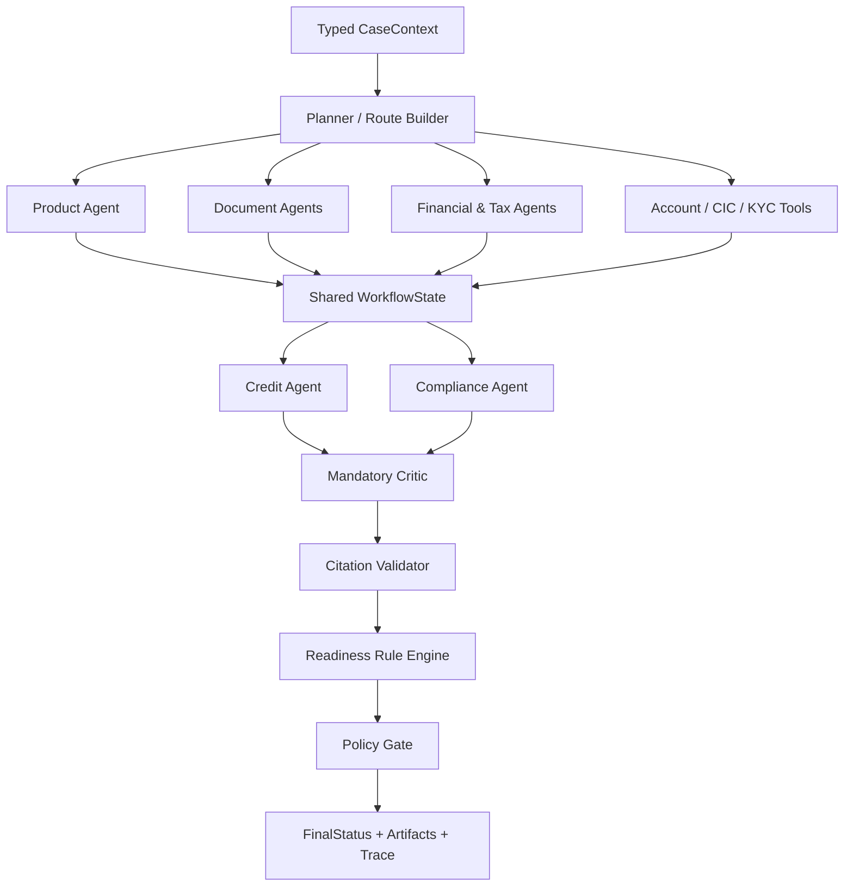
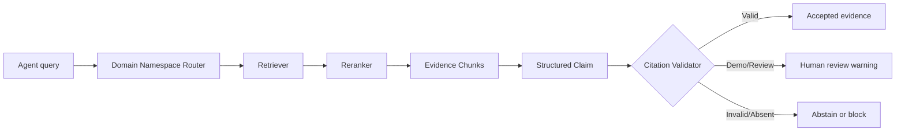
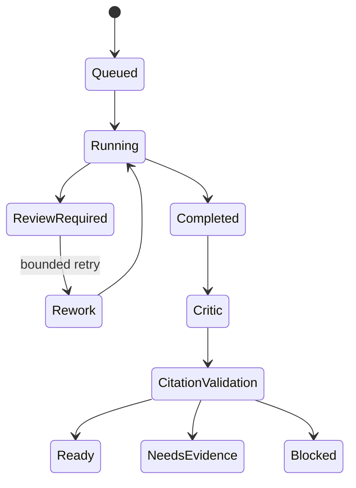

# NexusOps AI — Multi-Agent Layer

**Production:** [https://nexusopsai.site/](https://nexusopsai.site/)
**System overview:** [Root README](../README.md)
**Backend API:** [Backend README](../backend/README.md)
**Frontend:** [Frontend README](../frontend/README.md)

Agent Layer là lõi agentic của NexusOps AI. Lớp này sở hữu product contracts, typed workflow state, routing, specialist agents, deterministic financial rules, domain-specific RAG, tool adapters, Mandatory Critic và Citation Validator. Kết quả của Agent Layer là readiness recommendation dành cho human-in-the-loop, không phải quyết định phê duyệt hoặc từ chối tín dụng tự động.

## Agent architecture



## Planner và Specialist Agents

| Thành phần | Vai trò agentic | Output |
|---|---|---|
| Planner/Router | Phân tích context, chọn route và giới hạn node cần chạy | Danh sách node và route reasons |
| Product Agent | Diễn giải điều kiện sản phẩm trên dữ liệu đã chuẩn hóa | Product artifact |
| Document Classifier | Nhận diện tài liệu và ánh xạ canonical document IDs | Classified documents |
| Requirement Matrix | Xác định tài liệu bắt buộc theo sản phẩm | Required/missing documents |
| Account Turnover | Phân tích lịch sử và dòng tiền tài khoản thấu chi | Turnover metrics và warnings |
| Financial Metrics | Tính toán và đánh giá chỉ số tài chính | Metrics, claims và warnings |
| Tax Consistency | Đối chiếu doanh thu tài chính và khai thuế | Mismatch ratio và action |
| CIC/KYC Tools | Kiểm tra tín dụng, định danh và AML flags | Structured tool result |
| Credit Agent | Tổng hợp góc nhìn tín dụng từ nhiều artifact | Credit readiness assessment |
| Compliance Agent | Tổng hợp rủi ro tuân thủ | Compliance assessment |
| Mandatory Critic | Tìm thiếu sót, mâu thuẫn và kết luận quá mức | `PASS`, `REVISE`, `ESCALATE` |
| Citation Validator | Kiểm tra quote, hash, authority và provenance | Validation status và reasons |
| Policy Gate | Áp dụng điều kiện chặn cuối | Final status và blockers |

## Workflow theo sản phẩm

| Khâu | Working Capital | Corporate Overdraft |
|---|:---:|:---:|
| Existing Customer Gate | Có | Có |
| Product Agent | Có | Có |
| Document Classification | Có | Có |
| Requirement Matrix | Có | Có |
| Document Completeness | Có | Có |
| Account Turnover | Không bắt buộc | Có |
| Overdraft Metrics | Không | Có |
| Financial Metrics | Có | Có |
| Tax Consistency | Có | Có |
| CIC/KYC | Có | Có |
| Credit Agent | Có | Có |
| Compliance Agent | Theo flags | Theo flags |
| Mandatory Critic | Bắt buộc | Bắt buộc |
| Citation Validator | Bắt buộc | Bắt buộc |
| Rule Engine & Policy Gate | Bắt buộc | Bắt buộc |

## Artifact contract

| Trường | Ý nghĩa |
|---|---|
| `agent_id` | Tác tử/node tạo artifact |
| `engine` | Rule engine, tool hoặc model đã sử dụng |
| `status` | `PASS`, `WARNING`, `BLOCKED`, `REVIEW_REQUIRED` |
| `summary` | Tóm tắt kết quả có thể hiển thị |
| `claims` | Claim liên kết tới citation chunk |
| `metrics` | Chỉ số số học có cấu trúc |
| `warnings` | Mã cảnh báo máy có thể xử lý |
| `proposed_actions` | Hành động tiếp theo được đề xuất |
| `raw` | Payload kỹ thuật phục vụ audit/debug có kiểm soát |

## RAG và citation safety



| Validation | Ý nghĩa xử lý |
|---|---|
| `VALID` | Nguồn và trích dẫn đạt yêu cầu |
| `WARNING_DEMO_ONLY` | Chỉ được dùng trong demo, không phải policy chính thức |
| `REVIEW_REQUIRED` | Cần chuyên viên kiểm tra |
| `STALE_OR_UNVERIFIED` | Nguồn cũ hoặc chưa xác minh |
| `INVALID_QUOTE/HASH/AUTHORITY` | Không được dùng làm căn cứ |
| `ABSTAIN_NO_EVIDENCE` | Agent phải từ chối kết luận khi không có bằng chứng |

`final_rag_data_normalized_v1.json` là nguồn read-only. Các record synthetic phải có disclaimer. Các ngưỡng trong `configs/products/*.json` là `SYNTHETIC_DEMO_POLICY`, không phải chính sách tín dụng chính thức.

## Deterministic rules và model reasoning

| Năng lực | Deterministic | Model-assisted |
|---|:---:|:---:|
| Document matrix | Có | Không được ghi đè |
| Công thức tài chính | Có | Diễn giải kết quả |
| Route selection | Có cấu hình | Có thể hỗ trợ reason |
| Readiness hard blockers | Có | Không được ghi đè |
| Product/Credit/Compliance narrative | Fallback có cấu trúc | Có |
| Mandatory Critic | Có contract/fallback | Có thể dùng live model |
| Citation validation | Có | Không phụ thuộc model judgment đơn thuần |

## State và bounded rework

WorkflowState được truyền giữa các node thay vì dùng hội thoại tự do. Critic có thể yêu cầu chỉnh sửa nhưng số vòng rework bị giới hạn để tránh vòng lặp vô hạn. Backend persist state sau mỗi node, do đó UI chỉ chuyển bước khi nhận được kết quả thực tế.



## Tool use

| Nhóm công cụ | Mục đích | Nguyên tắc an toàn |
|---|---|---|
| Banking data adapters | Truy vấn dữ liệu tài khoản và hồ sơ | Allowlist, structured response |
| CIC/KYC/AML adapters | Kiểm tra tín dụng và tuân thủ | Không tự suy diễn khi tool lỗi |
| RAG tools | Retrieve/rerank evidence | Namespace và citation validation |
| External action adapters | Tạo task/draft/request | Approval và idempotency bắt buộc |

## Live mode

```powershell
$env:NEXUSOPS_AI_MODE="live"
$env:NEXUSOPS_DEMO_MODE="false"
python scripts\live_fpt_smoke_test.py
```

| Biến | Ý nghĩa production |
|---|---|
| `NEXUSOPS_AI_MODE=live` | Bật provider live |
| `NEXUSOPS_DEMO_MODE=false` | Không dùng hành vi demo |
| `NEXUSOPS_ENABLE_MOCK_APIS=false` | Tắt mock external endpoints |
| `FPT_AI_API_KEY` | Secret cục bộ, không commit repository |

## Kiểm tra Agent Layer

```powershell
.\backend\.venv313\Scripts\python.exe -m unittest discover -s agent/tests -v
```

| Nhóm kiểm tra | Mục tiêu |
|---|---|
| Contract tests | Typed input/output không sai schema |
| Routing tests | Chọn đúng route theo sản phẩm và flags |
| Specialist tests | Metrics, warnings và actions đúng quy tắc |
| Citation tests | Chặn nguồn/quote không hợp lệ |
| Integration tests | Planner, specialist, critic và persistence phối hợp đúng |

## Production boundary

Agent Layer hỗ trợ quyết định của con người, không tự cấp tín dụng. Production website là [https://nexusopsai.site/](https://nexusopsai.site/). Việc dọn scripts test/debug phải là thay đổi riêng sau khi benchmark và audit evidence đã được lưu; seed/config cần thiết cho khởi tạo vẫn được giữ theo kế hoạch triển khai.
