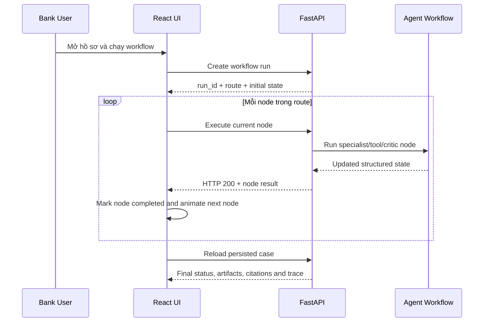
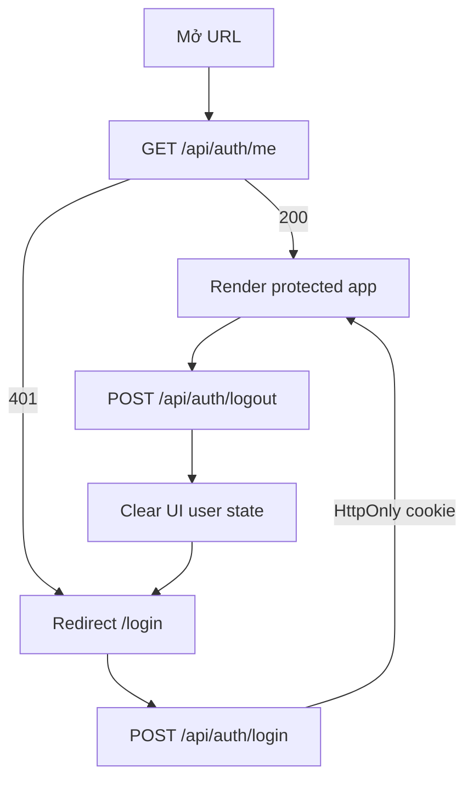

# NexusOps AI — React Orchestration Interface

**Production:** [https://nexusopsai.site/](https://nexusopsai.site/)
**System overview:** [Root README](../README.md)
**Backend:** [Backend README](../backend/README.md)
**Agent layer:** [Agent README](../agent/README.md)

Frontend NexusOps AI là giao diện điều phối và quan sát workflow agentic. React không tự tính route, không chạy mô hình trực tiếp và không quyết định chính sách. Mọi trạng thái nghiệp vụ được lấy từ FastAPI; UI chỉ chuyển sang node tiếp theo sau khi backend trả kết quả hoàn thành của node hiện tại.

## Trách nhiệm giao diện

| Khu vực | Chức năng | Nguồn dữ liệu |
|---|---|---|
| Login | Đăng nhập bằng tài khoản PostgreSQL | `/api/auth/login` |
| Session guard | Chặn route khi session không hợp lệ | `/api/auth/me` và HttpOnly cookie |
| Dashboard | Danh sách hồ sơ, tìm kiếm, bộ lọc, phân trang và SLA | Readiness API |
| Case Intake | Nhập hồ sơ và làm nổi bật trường thiếu | Product schema API |
| Route Preview | Hiển thị route dự kiến theo dữ liệu hồ sơ | Agent router qua backend |
| Workflow Canvas | Chạy và theo dõi từng agent node | Stepwise workflow API |
| Case Detail | Artifact, warning, metric và status | Persisted WorkflowState |
| Citation Library | Nguồn, quote, validation và related nodes | Citation results |
| Execution Trace | Công ty, node, duration và message | Run events |
| Approval UI/Profile | Người dùng, vai trò, hạn mức và logout | Auth/RBAC API |
| Report | Báo cáo bổ sung, người xử lý và xuất Word/PDF | Case, evidence và session user |

## Luồng giao diện agentic



Điểm quan trọng là tiến trình không dùng thời gian hard-code cho tất cả node. Duration được lấy từ lần xử lý gần nhất; UI không nhảy bước cho tới khi nhận phản hồi thành công từ backend.

## Các trang chính

| Route | Trang | Mục tiêu người dùng |
|---|---|---|
| `/login` | Đăng nhập | Tạo session hợp lệ trước khi vào hệ thống |
| `/` | Bảng điều hành | Tìm kiếm và theo dõi danh sách doanh nghiệp |
| `/cases/new` | Tiếp nhận hồ sơ | Tạo hồ sơ theo schema sản phẩm |
| `/cases/:caseId` | Chi tiết hồ sơ | Chạy workflow và xem kết quả agent |
| `/trace` | Nhật ký thực thi | Theo dõi node và thời gian theo công ty |
| `/citations/:caseId` | Thư viện trích dẫn | Kiểm tra bằng chứng của hồ sơ |
| `/citations/:caseId/:chunkId` | Chi tiết nguồn | Xem quote, provenance và validation |
| `/reports/:caseId` | Báo cáo | Xuất yêu cầu bổ sung Word/PDF |

## UI state và backend state

| Trạng thái | Chủ sở hữu | Cách frontend xử lý |
|---|---|---|
| Auth session | Backend/PostgreSQL | Gọi `/auth/me`; không lưu access token trong JavaScript |
| Case data | Backend/PostgreSQL | Fetch qua readiness adapter |
| WorkflowState | Backend/Agent/PostgreSQL | Render artifact và trace, không tự tạo kết quả |
| Node animation | Frontend | Chỉ phản ánh response thực tế |
| Search/filter/page | Frontend URL/UI state | Không thay đổi dữ liệu nghiệp vụ |
| Approval permission | Backend | UI hiển thị theo `can_approve` và blocker |

## Session và bảo vệ route



| Kiểm soát | Cách triển khai |
|---|---|
| Cookie | `HttpOnly`, `SameSite=Lax`, `Secure` trên HTTPS |
| Browser Back/Forward | Kiểm tra lại session khi pageshow/visibility thay đổi |
| Unauthorized API | Phát sự kiện xóa auth state và quay về login |
| HTML cache | Nginx trả `no-store`, tránh hiển thị trang cũ sau logout |

## Khả năng quan sát

| Dữ liệu hiển thị | Ý nghĩa |
|---|---|
| Node status | Queued, running, completed hoặc skipped |
| Duration | Thời gian backend xử lý node |
| Artifact status | PASS, WARNING, BLOCKED hoặc REVIEW_REQUIRED |
| Critic verdict | PASS, REVISE hoặc ESCALATE |
| Final status | Ready, needs evidence, blocked hoặc in progress |
| Citation validation | Nguồn hợp lệ, cần rà soát hoặc bị từ chối |
| SLA gần nhất | Thời gian xử lý cập nhật từ lần chạy thực tế |

## Chạy frontend

Docker:

```powershell
docker compose build frontend
docker compose up -d frontend
```

Local development:

```powershell
cd frontend
npm.cmd install
npm.cmd run dev
```

Production build check:

```powershell
cd frontend
npm.cmd run build
```

| URL | Mục đích |
|---|---|
| [https://nexusopsai.site/](https://nexusopsai.site/) | Production website |
| `http://localhost:3000` | Docker frontend |
| `http://localhost:5173` | Vite development server |

## Production boundary

Frontend không chứa API key, không gọi LLM trực tiếp và không sử dụng `mock-data.ts` làm nguồn runtime production. Nginx reverse proxy chuyển `/api/*` tới backend. Production phải sử dụng HTTPS để bật Secure cookie và chỉ cấu hình origin được phép ở backend.
